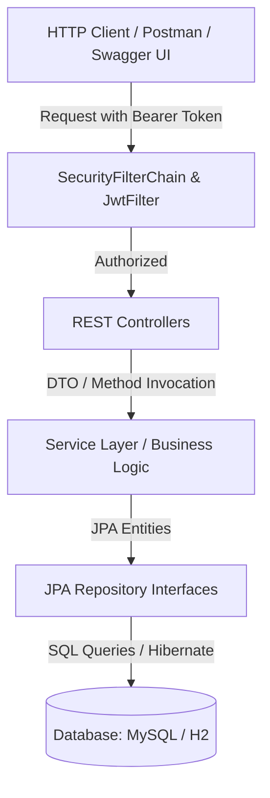

# 🌱 Agrix API - Agricultural Management System

[](https://www.oracle.com/java/)
[](https://spring.io/projects/spring-boot)
[](https://www.docker.com/)
[](https://swagger.io/)
[](https://github.com/features/actions)
[](https://opensource.org/licenses/MIT)

> 🇺🇸 **English** | 🇧🇷 [**Versão em Português**](README.md)

A complete and modular RESTful API built for agricultural ecosystem management — covering farms, crops, fertilizer inputs, and robust authentication based on JWT tokens and RBAC permissions.

## 📑 Table of Contents
 
- [📝 About The Project](#-about-the-project)
- [🖼️ Preview](#️-preview)
- [🌐 Application Deployment](#-application-deployment)
- [⚡ API Endpoints](#-api-endpoints)
- [✨ Features](#-features)
- [🛠️ Technologies & Tools](#️-technologies--tools-used)
- [🏛️ Solution Architecture](#️-solution-architecture)
- [📁 Repository Structure](#-repository-structure)
- [💡 Technical Decisions](#-technical-decisions)
- [🚀 How to Run the Project](#-how-to-run-the-project)
- [🧪 Running Tests](#-running-tests)
- [📄 License](#-license)
-

## 📝 About The Project

**Agrix** is a backend solution designed for integrated agribusiness property management. The system allows users to register farms, track planned or harvested crops associated with each property, link recommended fertilizers, and perform advanced crop queries by harvest period.

The application emphasizes **layered security**, **code maintainability**, and **adherence to industry standards**, using Java 17, Spring Boot 3, layered architecture (Controller-Service-Repository), relational databases (MySQL/H2), and containerization via Docker.

## 🖼️ Preview


## 🌐 Application Deployment

The API is deployed on **Render** with interactive documentation ready for live testing:

👉 **Swagger UI (Online):** [https://agrix-s01x.onrender.com/swagger-ui/index.html](https://agrix-s01x.onrender.com/swagger-ui/index.html)

> ℹ️ **Availability Note:** On Render's free tier, the web service spins down after periods of inactivity. If the service is sleeping, the first request may take 30 to 50 seconds to boot the container.

## ⚡ API Endpoints

Below are the primary resources and routes mapped in the API:

| Method | Route | Description | Access Level (RBAC) |
|---|---|---|---|
| `POST` | `/persons` | Registers a new user account | **Public** |
| `POST` | `/auth/login` | Authenticates user and generates JWT token | **Public** |
| `POST` | `/farms` | Registers a new farm | `USER`, `MANAGER`, `ADMIN` |
| `GET` | `/farms` | Lists all registered farms | `USER`, `MANAGER`, `ADMIN` |
| `GET` | `/farms/{id}` | Retrieves details of a farm by ID | `USER`, `MANAGER`, `ADMIN` |
| `POST` | `/farms/{farmId}/crops` | Adds a new crop to a farm | `USER`, `MANAGER`, `ADMIN` |
| `GET` | `/farms/{farmId}/crops` | Lists all crops belonging to a farm | `USER`, `MANAGER`, `ADMIN` |
| `GET` | `/crops` | Lists all crops in the system | `MANAGER`, `ADMIN` |
| `GET` | `/crops/{id}` | Retrieves crop details by ID | `USER`, `MANAGER`, `ADMIN` |
| `GET` | `/crops/search?start=...&end=...` | Filters crops within a harvest date range | `USER`, `MANAGER`, `ADMIN` |
| `POST` | `/crops/{cropId}/fertilizers/{fertilizerId}` | Associates a fertilizer with a crop | `USER`, `MANAGER`, `ADMIN` |
| `GET` | `/crops/{cropId}/fertilizers` | Lists all fertilizers associated with a crop | `USER`, `MANAGER`, `ADMIN` |
| `POST` | `/fertilizers` | Registers a new fertilizer input | `ADMIN` |
| `GET` | `/fertilizers` | Lists all registered fertilizers | `ADMIN` |
| `GET` | `/fertilizers/{id}` | Retrieves a fertilizer by ID | `ADMIN` |

## ✨ Features

- **Stateless Security & RBAC (Role-Based Access Control):**
  - Stateless authentication powered by JWT tokens digitally signed using HMAC256.
  - Password hashing with the `BCrypt` algorithm.
  - Granular access levels: `USER` (core operations), `MANAGER` (crop monitoring & querying), and `ADMIN` (unrestricted access and input management).
- **Comprehensive Agribusiness Management:**
  - Full CRUD for farms with area metrics and relationship mapping to crops.
  - Tracking of agricultural crops with planting and estimated harvest dates.
  - N:N (Many-to-Many) relationship between crops and fertilizers.
- **Global Exception Handling:**
  - Centralized interception using `@ControllerAdvice` (`GeneralControllerAdvice`), providing clean and consistent JSON error responses for business errors (`CustomError`), denied access (`403 Forbidden`), or missing entities (`404 Not Found`).
- **Live Documentation with Swagger / OpenAPI 3:**
  - Richly documented endpoints using `@Operation`, `@ApiResponse`, and seamless integration with `BearerAuth` for in-browser authorization.

## 🛠️ Technologies & Tools Used

- **Core & Runtime:** Java 17 (OpenJDK / Eclipse Temurin), Spring Boot 3.1.1.
- **Persistence & ORM:** Spring Data JPA, Hibernate ORM, MySQL 8.0 (Production), H2 Database (Testing and local development).
- **Security & Auth:** Spring Security 6, Auth0 Java JWT (v4.4.0), BCrypt.
- **API Documentation:** Springdoc OpenAPI UI 2.2.0 (Swagger 3).
- **Testing & Quality:** JUnit 5 (Jupiter), Mockito, MockMvc (Spring Boot Test), JaCoCo (Code Coverage), Maven Checkstyle Plugin (Google Style Guide).
- **DevOps & Infrastructure:** Docker (Multi-stage build), Docker Compose, GitHub Actions (CI/CD Pipeline), Render Cloud Platform.

## 🏛️ Solution Architecture

The application adopts the classic Layered Architecture pattern, ensuring loose coupling and testability:



## 📁 Repository Structure

```text
agrix/
├── .github/
│   └── workflows/
│       └── ci.yml               # Continuous Integration pipeline (GitHub Actions)
├── images/                      # Database diagrams and asset previews
├── src/
│   ├── main/
│   │   ├── java/com/betrybe/agrix/
│   │   │   ├── config/          # OpenAPI / Swagger configuration
│   │   │   ├── controllers/     # REST Endpoints and DTO mappings
│   │   │   ├── error/           # Global exception handlers (@ControllerAdvice)
│   │   │   ├── models/
│   │   │   │   ├── entities/    # JPA Entities (Farm, Crop, Fertilizer, Person)
│   │   │   │   └── repositories/# Spring Data JPA interfaces
│   │   │   ├── security/        # JWT Filters, SecurityConfig, and RBAC
│   │   │   └── services/        # Business logic and domain validations
│   │   └── resources/
│   │       ├── application.properties      # General configurations (In-memory H2)
│   │       └── application-prod.properties # Production configurations (MySQL)
│   └── test/
│       └── java/com/betrybe/agrix/         # Unit and integration test suite
├── docker-compose.yml           # Orchestration for API + MySQL 8.0 containers
├── Dockerfile                   # Optimized multi-stage build for cloud deployments
├── pom.xml                      # Maven dependencies and build plugins
├── render.yaml                  # Infrastructure-as-Code blueprint for Render
└── README.md                    # Primary repository documentation
```

## 💡 Technical Decisions

1. **Multi-stage Dockerfile Build:**
   - Clear decoupling between the build phase (`maven:3.9.6-alpine`) and the lightweight runtime image (`eclipse-temurin:17-jre-alpine`), decreasing the final image footprint and omitting unneeded development tools in production.
2. **Non-Root Container Execution:**
   - Implementation of a dedicated system user and group (`spring:spring`), avoiding running the Java runtime as superuser (`root`).
3. **Stateless JWT Authentication:**
   - Usage of stateless session management via JWT tokens, facilitating horizontal scalability without requiring distributed session stores.
4. **Environment Database Isolation:**
   - H2 in-memory database for fast, isolated test execution, alongside containerized MySQL 8 to replicate identical production conditions.
5. **Quality Gates via CI/CD Automation:**
   - GitHub Actions pipeline enforcing automated code style validation (Checkstyle Google Checks), full test suite execution, and JaCoCo coverage report generation on every commit and PR.

## 🚀 How to Run the Project

### Prerequisites
- **Java 17 (JDK)**
- **Maven** (or use the provided wrapper `mvnw` / `mvnw.cmd`)
- **Docker and Docker Compose** (optional, for containerized execution)

### Option 1: Via Docker Compose (Recommended)
To run the API alongside the MySQL 8 database container:

```bash
docker compose up --build -d
```

The API will be available at: `http://localhost:8080/swagger-ui.html`

### Option 2: Locally via Maven (In-Memory H2 Database)

On Linux / macOS / Git Bash:
```bash
./mvnw spring-boot:run
```

On Windows PowerShell / CMD:
```powershell
.\mvnw.cmd spring-boot:run
```

## 🧪 Running Tests

To run the complete unit and integration test suite:

```bash
# Run all tests
./mvnw clean test

# Verify code style standards (Checkstyle)
./mvnw checkstyle:check

# Generate JaCoCo coverage report
./mvnw jacoco:report
```

## 📄 License

This project is licensed under the [MIT](LICENSE) License.
