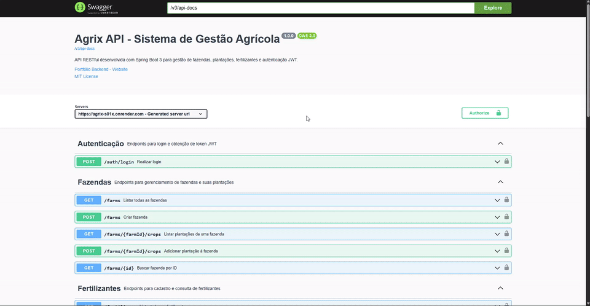
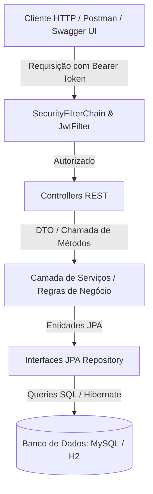

# 🌱 Agrix API - Sistema de Gestão Agrícola

[](https://www.oracle.com/java/)
[](https://spring.io/projects/spring-boot)
[](https://www.docker.com/)
[](https://swagger.io/)
[](https://github.com/features/actions)
[](https://opensource.org/licenses/MIT)

> 🇧🇷 **Português** | 🇺🇸 [**English Version**](README.en.md)

API RESTful completa e modular desenvolvida para controle de ecossistemas agrícolas — abrangendo fazendas, safras/plantações, insumos de fertilização e autenticação robusta baseada em tokens JWT e permissões RBAC.

## 📌 Sumário / Navegação Rápida

- [📝 Sobre o Projeto](#-sobre-o-projeto)
- [🖼️ Preview](#️-preview)
- [🌐 Deploy da Aplicação](#-deploy-da-aplicação)
- [⚡ API Endpoints](#-api-endpoints)
- [✨ Funcionalidades](#-funcionalidades)
- [🛠️ Tecnologias e Ferramentas](#️-tecnologias-e-ferramentas-utilizadas)
- [🏛️ Arquitetura da Solução](#️-arquitetura-da-solução)
- [📁 Estrutura do Repositório](#-estrutura-do-repositório)
- [💡 Decisões Técnicas](#-decisões-técnicas)
- [🚀 Como Executar o Projeto](#-como-executar-o-projeto)
- [🧪 Executando os Testes](#-executando-os-testes)
- [📄 Licença](#-licença)


## 📝 Sobre o Projeto

O **Agrix** é uma solução de backend voltada para a gestão integrada de propriedades do agronegócio. O sistema permite cadastrar fazendas, registrar safras planejadas ou colhidas associadas a cada propriedade, vincular fertilizantes recomendados e realizar buscas avançadas de colheitas por período.

A aplicação prioriza **segurança em camadas**, **manutenibilidade de código** e **aderência aos padrões da indústria**, utilizando Java 17, Spring Boot 3, arquitetura em camadas (Controller-Service-Repository), banco relacional (MySQL/H2) e containerização através de Docker.

## 🖼️ Preview



## 🌐 Deploy da Aplicação

A API está hospedada no **Render** e com a documentação interativa pronta para execução e testes online:

👉 **Swagger UI (Online):** [https://agrix-s01x.onrender.com/swagger-ui/index.html](https://agrix-s01x.onrender.com/swagger-ui/index.html)

> ℹ️ **Nota de Disponibilidade:** No plano gratuito do Render, o serviço entra em repouso após períodos sem tráfego. Caso a aplicação esteja em espera, a primeira requisição poderá levar cerca de 30 a 50 segundos para despertar o container.

## ⚡ API Endpoints

Abaixo estão os principais recursos e rotas mapeadas na API:

| Método | Rota | Descrição | Nível de Acesso (RBAC) |
|---|---|---|---|
| `POST` | `/persons` | Cadastra uma nova pessoa usuária | **Público** |
| `POST` | `/auth/login` | Autenticação e geração de token JWT | **Público** |
| `POST` | `/farms` | Cadastra uma nova fazenda | `USER`, `MANAGER`, `ADMIN` |
| `GET` | `/farms` | Lista todas as fazendas | `USER`, `MANAGER`, `ADMIN` |
| `GET` | `/farms/{id}` | Busca os detalhes de uma fazenda por ID | `USER`, `MANAGER`, `ADMIN` |
| `POST` | `/farms/{farmId}/crops` | Registra uma nova plantação em uma fazenda | `USER`, `MANAGER`, `ADMIN` |
| `GET` | `/farms/{farmId}/crops` | Lista todas as plantações de uma fazenda | `USER`, `MANAGER`, `ADMIN` |
| `GET` | `/crops` | Lista todas as plantações do sistema | `MANAGER`, `ADMIN` |
| `GET` | `/crops/{id}` | Busca os detalhes de uma plantação por ID | `USER`, `MANAGER`, `ADMIN` |
| `GET` | `/crops/search?start=...&end=...` | Filtra plantações por intervalo de datas de colheita | `USER`, `MANAGER`, `ADMIN` |
| `POST` | `/crops/{cropId}/fertilizers/{fertilizerId}` | Associa um fertilizante a uma plantação | `USER`, `MANAGER`, `ADMIN` |
| `GET` | `/crops/{cropId}/fertilizers` | Lista fertilizantes vinculados a uma plantação | `USER`, `MANAGER`, `ADMIN` |
| `POST` | `/fertilizers` | Cadastra um novo insumo fertilizante | `ADMIN` |
| `GET` | `/fertilizers` | Lista todos os fertilizantes cadastrados | `ADMIN` |
| `GET` | `/fertilizers/{id}` | Busca um fertilizante por ID | `ADMIN` |

## ✨ Funcionalidades

- **Segurança Stateless & RBAC (Role-Based Access Control):**
  - Autenticação stateless via token JWT assinado digitalmente com HMAC256.
  - Criptografia de senhas com algoritmo `BCrypt`.
  - Níveis de permissão distintos: `USER` (operações fundamentais), `MANAGER` (gestão e consulta de safras) e `ADMIN` (acesso irrestrito e gestão de insumos).
- **Gestão Agropecuária Completa:**
  - CRUD de fazendas com cálculo de áreas e vínculo com plantações.
  - Associação e rastreamento de safras com datas de plantio e previsão de colheita.
  - Relação N:N (Muitos-para-Muitos) entre plantações e fertilizantes.
- **Tratamento Global de Exceções:**
  - Interceptação centralizada via `@ControllerAdvice` (`GeneralControllerAdvice`), garantindo respostas limpas e padronizadas para erros de negócio (`CustomError`), acessos negados (`403 Forbidden`) ou entidades inexistentes (`404 Not Found`).
- **Documentação Viva com Swagger / OpenAPI 3:**
  - Rotas enriquecidas com anotações `@Operation`, `@ApiResponse` e integração com `BearerAuth` para autorização direta no navegador.

## 🛠️ Tecnologias e Ferramentas Utilizadas

- **Core & Runtime:** Java 17 (OpenJDK / Eclipse Temurin), Spring Boot 3.1.1.
- **Persistência & ORM:** Spring Data JPA, Hibernate ORM, MySQL 8.0 (Produção), H2 Database (Testes e desenvolvimento local).
- **Segurança & Autenticação:** Spring Security 6, Auth0 Java JWT (v4.4.0), BCrypt.
- **Documentação de API:** Springdoc OpenAPI UI 2.2.0 (Swagger 3).
- **Testes & Qualidade:** JUnit 5 (Jupiter), Mockito, MockMvc (Spring Boot Test), JaCoCo (Cobertura de Código), Maven Checkstyle Plugin (Google Style Guide).
- **DevOps & Infra:** Docker (Multi-stage build), Docker Compose, GitHub Actions (Pipeline CI/CD), Render Cloud Platform.

## 🏛️ Arquitetura da Solução

O sistema adota o padrão de arquitetura em camadas (Layered Architecture), garantindo desacoplamento e facilidade para testes:



## 📁 Estrutura do Repositório

```text
agrix/
├── .github/
│   └── workflows/
│       └── ci.yml               # Pipeline de integração contínua (GitHub Actions)
├── images/                      # Diagramas e esquemas de dados
├── src/
│   ├── main/
│   │   ├── java/com/betrybe/agrix/
│   │   │   ├── config/          # Configuração OpenAPI / Swagger
│   │   │   ├── controllers/     # Endpoints REST e mapeamentos DTO
│   │   │   ├── error/           # Handlers globais de exceção (@ControllerAdvice)
│   │   │   ├── models/
│   │   │   │   ├── entities/    # Entidades JPA (Farm, Crop, Fertilizer, Person)
│   │   │   │   └── repositories/# Interfaces Spring Data JPA
│   │   │   ├── security/        # Filtros JWT, SecurityConfig e RBAC
│   │   │   └── services/        # Regras de negócio e validações
│   │   └── resources/
│   │       ├── application.properties      # Configurações gerais (H2 em memória)
│   │       └── application-prod.properties # Configurações de produção (MySQL)
│   └── test/
│       └── java/com/betrybe/agrix/         # Bateria de testes unitários e de integração
├── docker-compose.yml           # Orquestração do container da API + MySQL 8.0
├── Dockerfile                   # Build multi-stage otimizado para deploy em nuvem
├── pom.xml                      # Dependências Maven e plugins de build
├── render.yaml                  # Blueprint de infraestrutura como código para o Render
└── README.md                    # Documentação principal do projeto
```

## 💡 Decisões Técnicas

1. **Build Multi-stage no Dockerfile:**
   - Separação clara entre o estágio de compilação (`maven:3.9.6-alpine`) e a imagem de runtime final (`eclipse-temurin:17-jre-alpine`). Isso reduz significativamente o tamanho da imagem final e remove ferramentas desnecessárias em produção.
2. **Execução Segura em Container (Non-Root):**
   - Criação de um usuário e grupo dedicados (`spring:spring`), evitando a execução do processo Java como superusuário (`root`).
3. **Autenticação Stateless com JWT:**
   - Adoção de autenticação sem estado (Stateless Session) via token JWT, permitindo escalabilidade horizontal sem necessidade de gerenciar sessões compartilhadas no servidor.
4. **Isolamento de Ambientes de Banco de Dados:**
   - Utilização do H2 Database para execução de testes rápidos e isolados (sem dependência de banco externo ativo), e MySQL 8 em containers para simulação de produção idêntica ao ambiente real.
5. **Automação com Quality Gates (CI/CD):**
   - Pipeline no GitHub Actions executando verificação de estilo (Checkstyle Google), suíte de testes unitários e geração de relatórios JaCoCo a cada commit/PR.

## 🚀 Como Executar o Projeto

### Pré-requisitos
- **Java 17 (JDK)**
- **Maven** (ou utilizar o wrapper incluso `mvnw` / `mvnw.cmd`)
- **Docker e Docker Compose** (opcional, para execução containerizada)

### Opção 1: Via Docker Compose (Recomendado)
Para rodar a API junto com o banco MySQL 8 em containers locais:

```bash
docker compose up --build -d
```

A API estará acessível em: `http://localhost:8080/swagger-ui.html`

### Opção 2: Localmente via Maven (Banco H2 em Memória)

No terminal (Linux / macOS / Git Bash):
```bash
./mvnw spring-boot:run
```

No Windows PowerShell / CMD:
```powershell
.\mvnw.cmd spring-boot:run
```

## 🧪 Executando os Testes

Para rodar toda a suíte de testes unitários e de integração:

```bash
# Executar todos os testes
./mvnw clean test

# Verificar conformidade de código (Checkstyle)
./mvnw checkstyle:check

# Gerar relatório de cobertura JaCoCo
./mvnw jacoco:report
```

## 📄 Licença

Este projeto está sob a licença [MIT](LICENSE).
