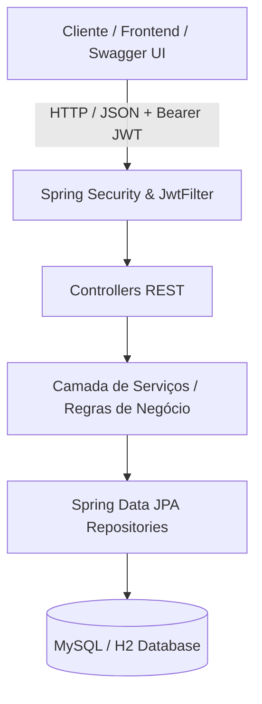

# 🌱 Agrix API - Sistema de Gestão Agrícola

[](https://www.oracle.com/java/)
[](https://spring.io/projects/spring-boot)
[](https://www.docker.com/)
[](https://swagger.io/)
[](https://github.com/features/actions)
[](https://opensource.org/licenses/MIT)

API RESTful robusta e escalável desenvolvida para a gestão e monitoramento de propriedades rurais, controle de safras/plantações e distribuição de fertilizantes, implementando autenticação e autorização baseadas em **JWT** e **Spring Security**.

---

## 🎯 Funcionalidades Principais

- **Autenticação & Controle de Acesso (RBAC):**
  - Registro de usuários com níveis de acesso granulares: `USER`, `MANAGER` e `ADMIN`.
  - Autenticação stateless via tokens **JWT (JSON Web Tokens)**.
- **Gestão de Fazendas (Farms):**
  - Cadastro, listagem e detalhamento de fazendas.
- **Gestão de Plantações (Crops):**
  - Associação de plantações a fazendas específicas.
  - Busca avançada de plantações por intervalo de datas de colheita estimada.
- **Gestão de Fertilizantes (Fertilizers):**
  - Cadastro e consulta de fertilizantes (restrito a `ADMIN`).
  - Associação N:N entre plantações e fertilizantes aplicados.
- **Documentação Interativa (OpenAPI 3 / Swagger):**
  - Interface visual completa para exploração e testes de endpoints com suporte a autorização Bearer.

---

## 🛠️ Tecnologias e Ferramentas

- **Linguagem & Framework:** Java 17, Spring Boot 3.1.1
- **Persistência & Banco de Dados:** Spring Data JPA, Hibernate, MySQL 8.0, H2 Database (Testes)
- **Segurança:** Spring Security 6, Auth0 Java JWT, BCrypt Password Encoder
- **Documentação da API:** Springdoc OpenAPI UI (Swagger 3)
- **Testes & Qualidade:** JUnit 5, Mockito, Spring Boot Starter Test (MockMvc), JaCoCo
- **DevOps & Containerização:** Docker (Multi-stage build), Docker Compose, GitHub Actions (CI/CD)

---

## 🏛️ Arquitetura da Solução



---

## 📑 Documentação dos Endpoints (Swagger UI)

Após iniciar a aplicação, acesse a documentação interativa no navegador:

👉 **[http://localhost:8080/swagger-ui.html](http://localhost:8080/swagger-ui.html)**

### Principais Rotas

| Método | Endpoint | Descrição | Permissão |
|---|---|---|---|
| `POST` | `/persons` | Cadastro de novo usuário | Público |
| `POST` | `/auth/login` | Autenticação e geração de token JWT | Público |
| `POST` | `/farms` | Criação de nova fazenda | Autenticado (`USER`, `MANAGER`, `ADMIN`) |
| `GET` | `/farms` | Listagem de todas as fazendas | Autenticado (`USER`, `MANAGER`, `ADMIN`) |
| `GET` | `/farms/{id}` | Detalhes de uma fazenda | Autenticado (`USER`, `MANAGER`, `ADMIN`) |
| `POST` | `/farms/{farmId}/crops` | Adicionar plantação à fazenda | Autenticado (`USER`, `MANAGER`, `ADMIN`) |
| `GET` | `/farms/{farmId}/crops` | Listar plantações de uma fazenda | Autenticado (`USER`, `MANAGER`, `ADMIN`) |
| `GET` | `/crops` | Listar todas as plantações | `MANAGER`, `ADMIN` |
| `GET` | `/crops/{id}` | Buscar plantação por ID | Autenticado |
| `GET` | `/crops/search?start=...&end=...` | Buscar safras por data de colheita | Autenticado |
| `POST` | `/crops/{cropId}/fertilizers/{fertilizerId}` | Associar fertilizante à plantação | Autenticado |
| `GET` | `/crops/{cropId}/fertilizers` | Listar fertilizantes de uma plantação | Autenticado |
| `POST` | `/fertilizers` | Cadastrar novo fertilizante | `ADMIN` |
| `GET` | `/fertilizers` | Listar fertilizantes | `ADMIN` |
| `GET` | `/fertilizers/{id}` | Buscar fertilizante por ID | `ADMIN` |

---

## 🚀 Como Executar o Projeto

### Opção 1: Via Docker Compose (Recomendado)

Suba a API e o banco de dados MySQL de forma totalmente automatizada:

```bash
docker compose up --build -d
```

A API estará pronta em `http://localhost:8080`.

### Opção 2: Localmente via Maven

1. Certifique-se de ter o **JDK 17** instalado.
2. Execute a aplicação:

```bash
# Windows
.\mvnw.cmd spring-boot:run

# Linux / Mac
./mvnw spring-boot:run
```

A aplicação subirá com banco H2 em memória por padrão.

---

## 🧪 Testes Automatizados e Qualidade

Para rodar todos os testes unitários e de integração:

```bash
# Executa todos os testes
./mvnw clean test

# Gera o relatório de cobertura de código (JaCoCo)
./mvnw jacoco:report
```

O relatório JaCoCo é gerado em `target/site/jacoco/index.html`.

---

## ☁️ Deploy no Render.com

A aplicação está configurada para deploy simplificado no **[Render.com](https://render.com/)**:

1. Conecte seu repositório GitHub ao Render.
2. Crie um novo **Web Service** selecionando o repositório.
3. Escolha o ambiente **Docker**. O arquivo [`Dockerfile`](file:///d:/Code/Java/Trybe/agrix/Dockerfile) multi-stage gerenciará o build e a execução.
4. Configure as seguintes variáveis de ambiente no painel:
   - `PORT`: `8080`
   - `SPRING_PROFILES_ACTIVE`: `prod`
   - `JWT_SECRET`: *(sua chave secreta segura)*
   - `SPRING_DATASOURCE_URL`: `jdbc:mysql://<host>:<port>/<db>` *(ou use banco PostgreSQL/MySQL gerenciado)*
   - `SPRING_DATASOURCE_USERNAME`: `<usuario>`
   - `SPRING_DATASOURCE_PASSWORD`: `<senha>`

---

## 📄 Licença

Este projeto está sob a licença [MIT](LICENSE).
